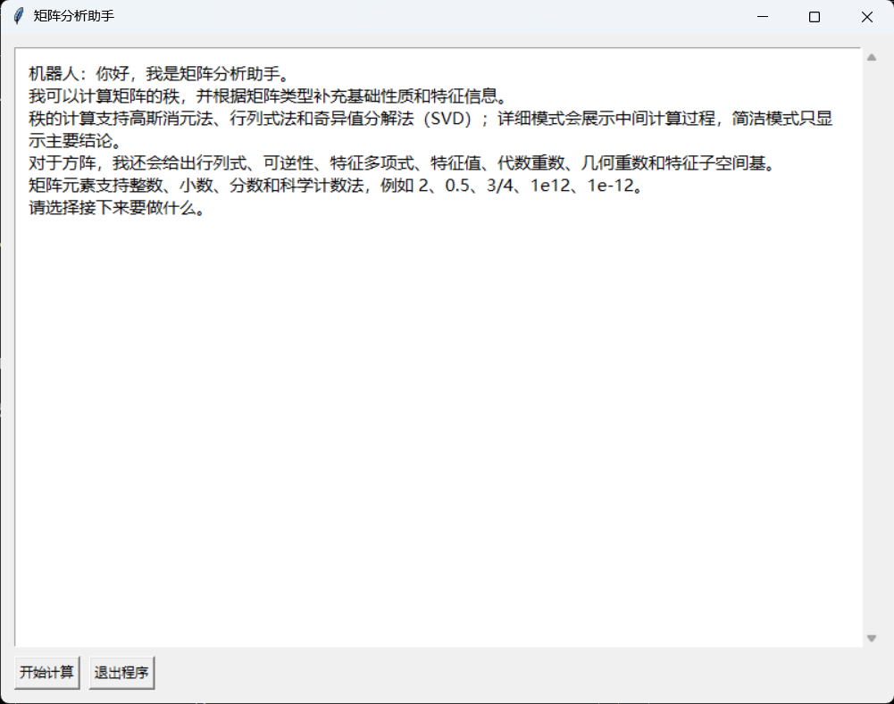

# Matrix Rank Calculator

在计算矩阵秩时，你是不是也遇到过这些情况：

❓ 拍照搜题太麻烦，只想快速验证答案
❓ 有答案却没有过程，看了也不会
❓ 解析过于抽象，根本看不懂

与其在这些工具里反复折腾，不如直接用一个真正为“理解过程”设计的工具。

👉 本项目专注于矩阵秩计算，支持逐步演示计算过程，并提供 高斯消元法 / 行列式法 / SVD 三种方法对比，让你不仅知道答案，更知道为什么。

---

## 🔗 项目地址

GitHub 仓库：
[https://github.com/Cheems-sudo/matrix-rank-calculator](https://github.com/Cheems-sudo/matrix-rank-calculator)

欢迎 Star ⭐ 和反馈！

---

## ✨ 项目亮点

* 🧠 **逐步展示计算过程**（不是只给结果）
* 🔁 **三种方法对比**：高斯 / 行列式 / SVD
* 🖥️ **图形界面（GUI）操作简单直观**
* 📊 适合教学、学习和算法验证

---

## 🚀 使用方法

### 1️⃣ 克隆仓库

```bash
git clone https://github.com/Cheems-sudo/matrix-rank-calculator
cd matrix-rank-calculator
```

### 2️⃣ 安装依赖

```bash
pip install numpy sympy
```

### 3️⃣ 运行程序

```bash
python matrix_rank_calculator.py
```

---

## 🖥️ 界面说明




---

## 📐 方法说明

### ✅ 高斯消元法（推荐默认）

* 适用于大多数情况
* 通过行变换得到阶梯矩阵
* 根据非零行数判断秩

### ⚠️ 行列式法

* 主要用于理论演示
* 更适合方阵是否满秩的判断
* 不适用于通用矩阵

### 🔬 SVD（奇异值分解）

* 数值稳定性最好
* 适用于浮点数据 / 含误差的数据
* 可处理“接近线性相关”的情况

---

## 🚀 使用方法

### 方法一：直接运行（推荐）
前往 Release 页面下载 `.exe` 文件，双击即可运行，无需安装 Python 环境。

---

### 方法二：从源码运行
如果你希望查看源码或进行修改，可以按以下步骤运行：

```bash
git clone https://github.com/Cheems-sudo/matrix-rank-calculator

cd matrix-rank-calculator

python matrix_rank_calculator.py


## 📁 项目结构

```text
.
├── matrix_rank_calculator.py   # 主入口（GUI）
├── matrix_rank/                # 核心算法实现
└── README.md
```

---

## ❓ 常见问题

### 为什么结果和手算不一致？

* 浮点数计算存在误差
* SVD 方法使用阈值判断“接近 0”的奇异值

### GUI 无法启动？

* 请确认 Python 环境支持 tkinter

---

## 🔮 后续可扩展

* 增加矩阵变换动画
* 支持更多线性代数功能（逆矩阵、特征值等）
* 优化输入格式（文件 / 批量输入）

---

## 📜 License

MIT License

---

## 👤 作者

* GitHub: [https://github.com/Cheems-sudo](https://github.com/Cheems-sudo)

---

如果这个项目对你有帮助，欢迎点个 Star ⭐！
