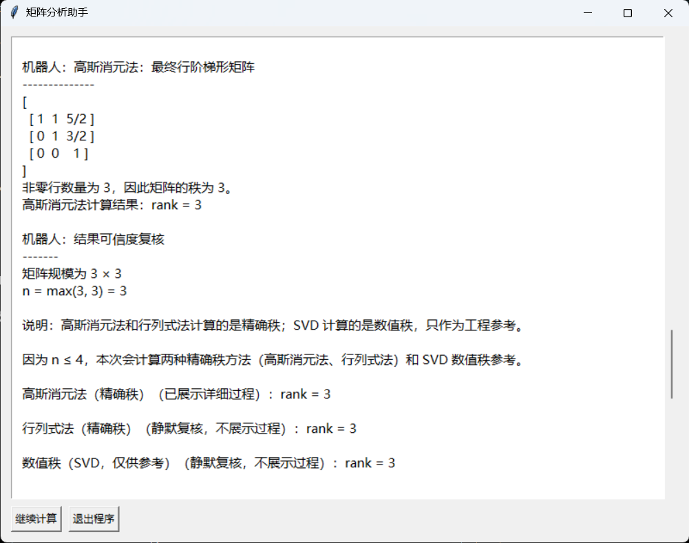
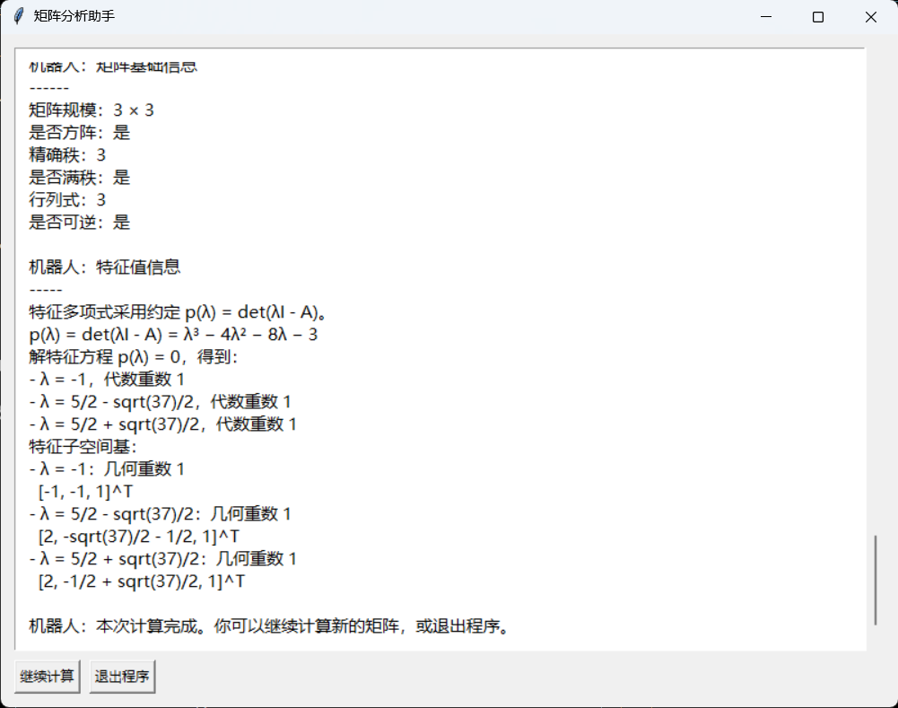

# Matrix Rank Calculator

Matrix Rank Calculator 是一个用于计算矩阵秩的 Python 小工具。项目提供 tkinter 图形界面，支持表格化输入矩阵，并可按不同模式展示计算结论或计算过程，适合线性代数学习、作业核对和算法验证。

项目目前支持三种计算方式：高斯消元法、行列式法和 SVD 数值秩。高斯消元法和行列式法用于精确秩计算，SVD 用于数值秩参考。

## 功能亮点

- 支持整数、小数、负数、分数和科学计数法输入。
- 使用 `sympy` 保留精确分数计算，减少浮点误差影响。
- 提供矩阵表格输入 UI，按行列位置填写元素，不再需要逐行输入整行文本。
- 矩阵输入区支持横向和纵向滚动，较大矩阵也可以在固定区域内填写。
- GUI 当前最多支持 `10 × 10` 矩阵，避免创建过多控件或触发耗时过长的符号计算。
- 支持简洁模式和详细模式：
  - 简洁模式只展示关键结论。
  - 详细模式展示所选方法的完整计算过程和复核信息。
- 输出矩阵基础信息总结，包括矩阵规模、是否方阵、精确秩、是否满秩、行列式和是否可逆。
- 对方阵输出精确特征多项式、特征值、代数重数、几何重数和特征子空间基。
- 高斯消元法会展示行变换过程。
- 行列式法适合小规模矩阵的理论验证。
- SVD 方法可作为浮点矩阵的数值秩参考。
- 当元素超出浮点数表示范围时，自动跳过 SVD，继续给出精确秩结果。
- 提供 tkinter 图形界面，无需命令行交互。

## 安装依赖

支持 Python 3.11 或更新版本。

```bash
pip install .
```

开发环境可安装测试、lint 和类型检查工具：

```bash
pip install -e ".[dev]"
```

如果只想查看或安装明确列出的运行时依赖，也可以使用：

```bash
pip install -r requirements.txt
```

`requirements.txt` 不会安装当前项目本身；完整安装仍推荐使用
`pip install .`。

## 运行方式

从源码运行：

```bash
git clone https://github.com/Cheems-sudo/matrix-rank-calculator
cd matrix-rank-calculator
python matrix_rank_calculator.py
```

根目录脚本是为原有使用方式保留的兼容入口。安装项目后推荐使用：

安装项目后也可以使用 GUI 命令：

```bash
matrix-rank-gui
```

## 命令行使用

CLI 适合脚本调用、自动化作业检查和无图形界面的环境。使用重复的 `--row` 参数输入矩阵：

```bash
matrix-rank \
  --row "1 2 3" \
  --row "2 4 6" \
  --method gaussian \
  --mode concise
```

每行元素可以用空格或逗号分隔。也可以通过标准输入传入矩阵：

```bash
printf "1,2\n3,4\n" | matrix-rank --method svd --mode detailed
```

`--method` 支持 `gaussian`、`determinant` 和 `svd`，`--mode` 支持 `concise` 和 `detailed`。

也可以直接读取 UTF-8 CSV 或文本文件：

```bash
matrix-rank --file matrix.csv
```

使用 JSON 输出可以在脚本中直接读取精确秩、SVD 参考、矩阵性质和特征信息：

```bash
matrix-rank --file matrix.csv --format json
```

将结果写入文件：

```bash
matrix-rank --file matrix.csv --format json --output result.json
```

查看当前版本：

```bash
matrix-rank --version
```

## 界面说明

启动程序后，先选择计算方法，再选择输出模式，然后输入矩阵行数和列数。确认尺寸后，界面会生成对应大小的矩阵表格，在每个单元格中填写一个矩阵元素即可。当前 GUI 支持的最大尺寸为 `10 × 10`。

矩阵表格带有横向和纵向滚动条。当矩阵行数或列数较多时，可以在输入区内滚动查看和填写不同位置的元素。

支持的元素格式示例：

```text
2
-3
0.5
-2/5
1e-3
```





## 计算模式说明

### 简洁模式

简洁模式用于快速查看关键结论，不展示中间消元、子式枚举或 SVD 分解过程。该模式会输出矩阵基础信息、特征值信息、精确秩和 SVD 数值秩参考。

### 详细模式

详细模式用于查看完整计算过程。根据所选方法，界面会展示高斯消元步骤、行列式法的子矩阵检查过程，或 SVD 的数值分解与阈值判断过程，并在结尾补充复核总结。

选择详细模式后，可以继续设置步骤播放速度，支持快速、正常和慢速。

## 方法说明

### 高斯消元法

高斯消元法通过初等行变换把矩阵化为行阶梯形矩阵，再根据非零行数量判断矩阵秩。该方法使用精确计算，结果可作为矩阵精确秩结论。

### 行列式法

行列式法通过寻找最高阶非零子行列式来确定矩阵秩。该方法也是精确秩计算方式，但需要枚举子矩阵，矩阵规模较大时计算量会快速增加，因此更适合小矩阵验证。

### SVD 数值秩

SVD 方法通过奇异值分解和阈值判断给出数值秩。它适合浮点数据和工程场景中的参考判断，但不是精确秩结论；当 SVD 数值秩与精确秩不一致时，应以高斯消元法或行列式法得到的精确秩为准。

如果矩阵元素过大或过小，无法安全转换为有限的双精度浮点数，程序会跳过 SVD 数值复核，并继续使用 `sympy` 给出精确秩结论。

输入解析允许十进制指数绝对值不超过 `10000`。这高于 float64
大约 `1e±308` 的常用范围，是为了保留 SymPy 精确计算能力；超出
float64 范围的输入仍可参与高斯消元、行列式和符号计算，但 SVD
会明确标记为不可用。

### 方阵可逆性

只有方阵才讨论行列式和可逆性。项目在矩阵基础信息中计算 `det(A)`，并根据 `det(A) != 0` 判断方阵是否可逆；非方阵没有行列式，也不判断为可逆矩阵。

### 特征值

只有方阵才有特征值。项目使用 `sympy` 按 `p(λ) = det(λI - A)` 计算精确特征多项式，并输出特征值、代数重数、几何重数和一组特征子空间基。非方阵会直接显示不适用说明。为避免符号计算耗时过长，当前仅对不超过 6 阶的方阵计算精确特征信息；如果表达式超出符号算法的处理范围，程序也会跳过该部分，但不影响精确秩结论。

## 项目结构

```text
.
├── matrix_rank_calculator.py      # 程序入口
├── CHANGELOG.md                   # 版本变更记录
├── .pre-commit-config.yaml        # 提交前质量检查
├── matrix_rank/
│   ├── app.py                     # 应用启动逻辑
│   ├── calculator.py              # 矩阵秩计算核心
│   ├── cli.py                     # 命令行入口
│   ├── delayed_output.py          # GUI 延迟输出控制
│   ├── eigen.py                   # 特征多项式和特征值
│   ├── formatting.py              # 矩阵和数学表达式格式化
│   ├── gui.py                     # tkinter 图形界面
│   ├── parsing.py                 # 矩阵元素解析
│   ├── version.py                 # 项目版本
│   ├── workflow.py                # 计算流程和结果汇总
│   └── __init__.py
├── assets/
│   ├── input.png                  # README 输入界面截图
│   └── output.png                 # README 输出界面截图
├── tests/
│   ├── test_calculator.py         # 计算核心测试
│   ├── test_app.py                # GUI 启动错误处理测试
│   ├── test_cli.py                # 命令行入口测试
│   ├── test_delayed_output.py     # GUI 步骤输出协议测试
│   ├── test_eigen.py              # 特征值测试
│   ├── test_entrypoint.py         # 程序入口测试
│   ├── test_formatting.py         # 格式化和编码兼容测试
│   ├── test_gui.py                # GUI 输入边界测试
│   ├── test_parsing.py            # 输入解析测试
│   ├── test_public_api.py          # 包级公开 API 测试
│   └── test_workflow.py           # 计算流程和结果汇总测试
├── requirements.txt               # 明确列出的运行时依赖
├── pyproject.toml                 # 项目元数据、依赖和工具配置
├── .gitattributes                 # Git 文本换行规则
├── .github/workflows/test.yml     # 多版本测试和质量检查
├── LICENSE
└── README.md
```

## 常见问题

### 为什么 SVD 结果可能和精确秩不同？

SVD 是数值方法，会根据阈值判断奇异值是否视为 0。对于病态矩阵、尺度差异很大的矩阵，或存在非常小但非零奇异值的矩阵，SVD 数值秩可能与精确秩不同。

### 为什么有时不显示 SVD 结果？

SVD 依赖双精度浮点数。如果某个精确输入转换后会溢出为无穷大，或下溢为 0，程序会停止本次 SVD 计算，避免输出误导性的数值秩。高斯消元法得到的精确秩仍然有效。

### GUI 无法启动怎么办？

请确认当前 Python 环境支持 `tkinter` 且存在可用的桌面显示环境。部分精简 Python 发行版可能没有包含 tkinter，服务器也可能没有图形桌面。`matrix-rank-gui` 会输出友好提示并退出；无图形环境请使用 `matrix-rank` 命令行工具。

### 如何运行测试？

```bash
python -m pytest -q
```

运行代码质量检查：

```bash
python -m ruff check .
python -m mypy matrix_rank
```

GitHub Actions 会在 Python 3.11、3.12 和 3.13 上运行测试，并单独执行 Ruff 与 mypy。

## 后续计划

- 增加更多边界情况测试。
- 优化计算过程展示文本。
- 在保持项目简洁的前提下完善打包发布流程。

## License

MIT License

## 作者信息

- GitHub: [https://github.com/Cheems-sudo](https://github.com/Cheems-sudo)
