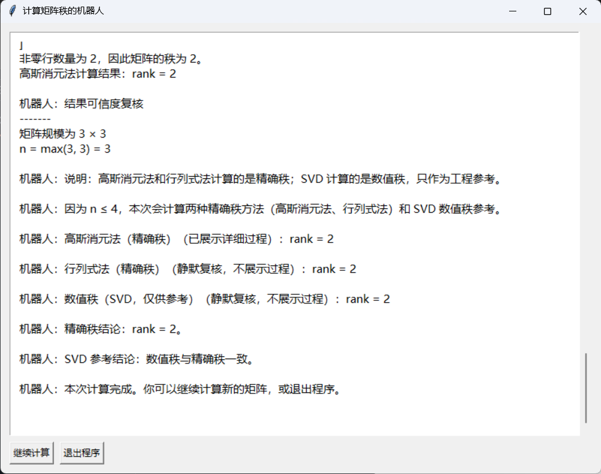

# Matrix Rank Calculator

Matrix Rank Calculator 是一个用于计算矩阵秩的 Python 小工具。项目提供 tkinter 图形界面，支持表格化输入矩阵，并可按不同模式展示计算结论或计算过程，适合线性代数学习、作业核对和算法验证。

项目目前支持三种计算方式：高斯消元法、行列式法和 SVD 数值秩。高斯消元法和行列式法用于精确秩计算，SVD 用于数值秩参考。

## 功能亮点

- 支持整数、小数、负数、分数和科学计数法输入。
- 使用 `sympy` 保留精确分数计算，减少浮点误差影响。
- 提供矩阵表格输入 UI，按行列位置填写元素，不再需要逐行输入整行文本。
- 矩阵输入区支持横向和纵向滚动，较大矩阵也可以在固定区域内填写。
- 支持简洁模式和详细模式：
  - 简洁模式只展示关键结论。
  - 详细模式展示所选方法的完整计算过程和复核信息。
- 输出矩阵基础信息总结，包括矩阵规模、是否方阵、精确秩、是否满秩、行列式和是否可逆。
- 高斯消元法会展示行变换过程。
- 行列式法适合小规模矩阵的理论验证。
- SVD 方法可作为浮点矩阵的数值秩参考。
- 提供 tkinter 图形界面，无需命令行交互。

## 安装依赖

建议使用 Python 3.11 或更新版本。

```bash
pip install -r requirements.txt
```

也可以手动安装依赖：

```bash
pip install numpy sympy pytest
```

## 运行方式

从源码运行：

```bash
git clone https://github.com/Cheems-sudo/matrix-rank-calculator
cd matrix-rank-calculator
python matrix_rank_calculator.py
```

## 界面说明

启动程序后，先选择计算方法，再选择输出模式，然后输入矩阵行数和列数。确认尺寸后，界面会生成对应大小的矩阵表格，在每个单元格中填写一个矩阵元素即可。

矩阵表格带有横向和纵向滚动条。当矩阵行数或列数较多时，可以在输入区内滚动查看和填写不同位置的元素。

支持的元素格式示例：

```text
2
-3
0.5
-2/5
1e-3
```




## 计算模式说明

### 简洁模式

简洁模式用于快速查看关键结论，不展示中间消元、子式枚举或 SVD 分解过程。该模式会输出矩阵基础信息、精确秩和 SVD 数值秩参考。

### 详细模式

详细模式用于查看完整计算过程。根据所选方法，界面会展示高斯消元步骤、行列式法的子矩阵检查过程，或 SVD 的数值分解与阈值判断过程，并在结尾补充复核总结。

## 方法说明

### 高斯消元法

高斯消元法通过初等行变换把矩阵化为行阶梯形矩阵，再根据非零行数量判断矩阵秩。该方法使用精确计算，结果可作为矩阵精确秩结论。

### 行列式法

行列式法通过寻找最高阶非零子行列式来确定矩阵秩。该方法也是精确秩计算方式，但需要枚举子矩阵，矩阵规模较大时计算量会快速增加，因此更适合小矩阵验证。

### SVD 数值秩

SVD 方法通过奇异值分解和阈值判断给出数值秩。它适合浮点数据和工程场景中的参考判断，但不是精确秩结论；当 SVD 数值秩与精确秩不一致时，应以高斯消元法或行列式法得到的精确秩为准。

### 方阵可逆性

只有方阵才讨论行列式和可逆性。项目在矩阵基础信息中计算 `det(A)`，并根据 `det(A) != 0` 判断方阵是否可逆；非方阵没有行列式，也不判断为可逆矩阵。

## 项目结构

```text
.
├── matrix_rank_calculator.py      # 程序入口
├── matrix_rank/
│   ├── app.py                     # 应用启动逻辑
│   ├── calculator.py              # 矩阵秩计算核心
│   ├── delayed_output.py          # GUI 延迟输出控制
│   ├── gui.py                     # tkinter 图形界面
│   ├── parsing.py                 # 矩阵元素解析
│   ├── workflow.py                # 计算流程和结果汇总
│   └── __init__.py
├── assets/
│   ├── input.png                  # README 输入界面截图
│   └── output.png                 # README 输出界面截图
├── tests/
│   ├── test_calculator.py         # 计算核心测试
│   ├── test_parsing.py            # 输入解析测试
│   └── test_workflow.py           # 计算流程和结果汇总测试
├── requirements.txt               # Python 依赖
├── LICENSE
└── README.md
```

## 常见问题

### 为什么 SVD 结果可能和精确秩不同？

SVD 是数值方法，会根据阈值判断奇异值是否视为 0。对于病态矩阵、尺度差异很大的矩阵，或存在非常小但非零奇异值的矩阵，SVD 数值秩可能与精确秩不同。

### GUI 无法启动怎么办？

请确认当前 Python 环境支持 `tkinter`。部分精简 Python 发行版可能没有包含 tkinter，需要单独安装或更换 Python 版本。

### 如何运行测试？

```bash
python -m pytest -q
```

## 后续计划

- 增加更多边界情况测试。
- 优化计算过程展示文本。
- 在保持项目简洁的前提下完善打包发布流程。

## License

MIT License

## 作者信息

- GitHub: [https://github.com/Cheems-sudo](https://github.com/Cheems-sudo)
